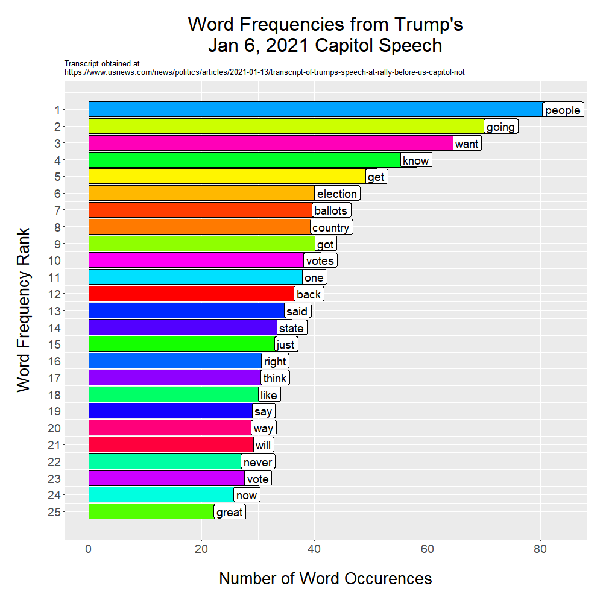

[ScientificProgrammer/TrumpInsurrectionSpeech](https://github.com/ScientificProgrammer/TrumpInsurrectionSpeech.git)

# README.md

## What is the purpose of this project?
This project contains an analysis of former President Donald J. Trump's speech to his supporters on January 6, 2021, prior to them attacking the United States (US) Capitol building. It was prepared using R and RStudio.

